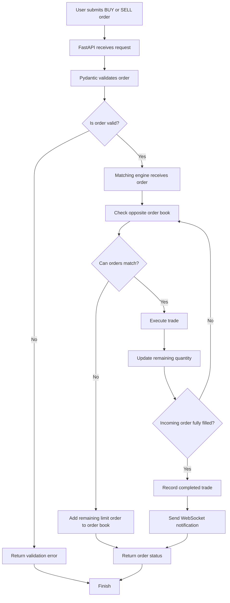

## 8. Order Execution Workflow

The following diagram illustrates how a buy or sell order will travel through PulseX Exchange.

```mermaid
flowchart TD
    A["User submits BUY or SELL order"]
    B["FastAPI receives request"]
    C["Pydantic validates order"]
    D{"Is order valid?"}
    E["Return validation error"]
    F["Matching engine receives order"]
    G["Check opposite order book"]
    H{"Can orders match?"}
    I["Execute trade"]
    J["Update remaining quantity"]
    K{"Incoming order fully filled?"}
    L["Add remaining limit order to order book"]
    M["Record completed trade"]
    N["Send WebSocket notification"]
    O["Return order status"]
    P["Finish"]

    A --> B --> C --> D
    D -->|No| E
    D -->|Yes| F --> G --> H
    H -->|Yes| I --> J --> K
    K -->|No| G
    K -->|Yes| M
    H -->|No| L
    L --> O
    M --> N --> O
    E --> P
    O --> P
```
