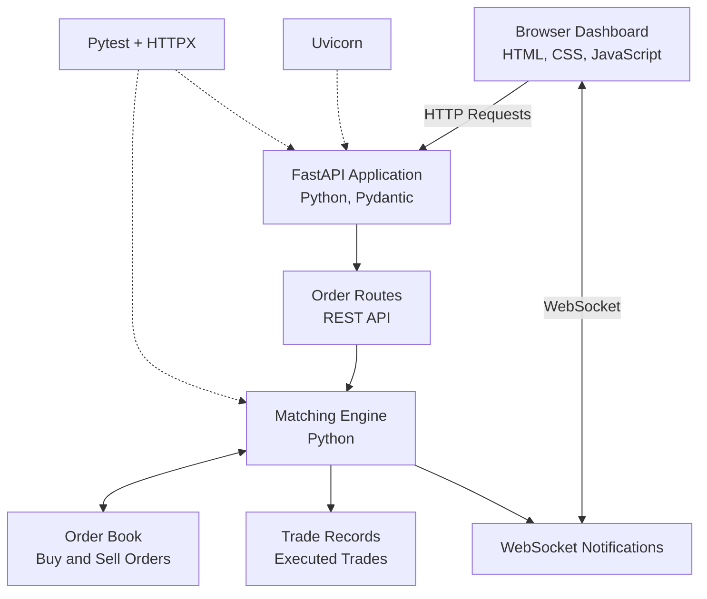

# PulseX Exchange — Architecture

**Status:** Proposed architecture. Subject to updates as implementation progresses.

```mermaid
flowchart TD
    A["Browser Dashboard<br/>HTML, CSS, JavaScript"]
    B["FastAPI Application<br/>Python, Pydantic"]
    C["Order Routes<br/>REST API"]
    D["Matching Engine<br/>Python"]
    E["Order Book<br/>Buy and Sell Orders"]
    F["Trade Records<br/>Executed Trades"]
    G["WebSocket Notifications"]

    A -->|"HTTP Requests"| B
    A <-->|"WebSocket"| G
    B --> C
    C --> D
    D <--> E
    D --> F
    D --> G

    H["Uvicorn"] -.-> B
    I["Pytest + HTTPX"] -.-> B
    I -.-> D
```
